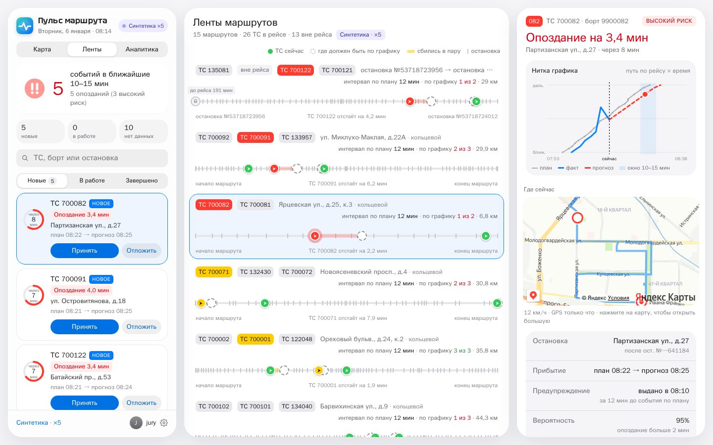
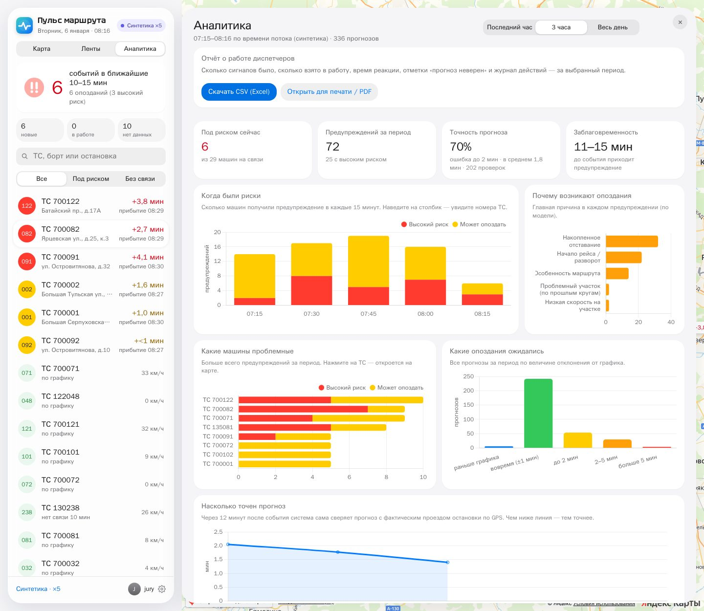
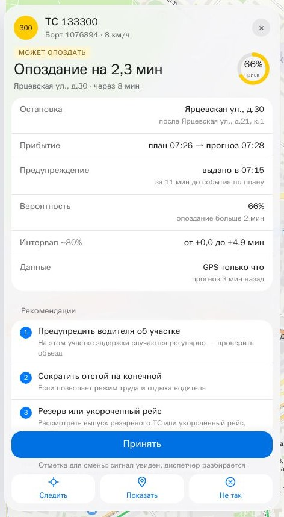

# Пульс маршрута

**Система раннего предупреждения об опозданиях наземного транспорта.** Она принимает поток телеметрии NDTP,
накладывает его на плановое расписание и **за 10–15 минут до события** прогнозирует опоздание автобуса на
остановке. Результат выводится на дашборд диспетчера: вероятность, интервал, причина, участок маршрута и
рекомендации, что делать.

Решение команды **venik** для хакатона Московского транспорта «Предиктор изменений в графике движения».

**Живые стенды** — вход: логин **`admin`**, пароль **`admin`**:
- https://2-26-85-218.sslip.io — реальный архив телеметрии хакатона 06.01.2026 (13 ТС), проигрывается как поток NDTP;
- https://synth.2-26-85-218.sslip.io — синтетика «3 автобуса на маршруте» (39 ТС на 13 реальных маршрутах).


*Карта (архив 06.01): карточка события с вероятностью, интервалом и рекомендациями; машина и целевая остановка в кадре.*



*Ленты (синтетика, 3 машины на маршруте): где каждый автобус сейчас и где должен быть по графику, очередь «Новые → В работе → Завершено», нитка графика и мини-карта.*



*Аналитика (синтетика): предупреждения и их заблаговременность, причины опозданий, проблемные машины, распределение ожидаемых отклонений, точность прогноза по фактическим проездам и отчёт о работе диспетчеров.*

## Возможности

- **Потоковый приём NDTP**: разбор кадров NPL/NPH/Nav, проверка CRC-16, ответ `NPH_RESULT`, одно TCP-соединение
  на терминал. Работает с эмулятором организаторов и с проигрыванием архива.
- **Прогноз опоздания на 10–15 минут**:
  - ансамбль CatBoost: MAE 64 с на test против 93 с у baseline, **score 0.752** на лидерборде;
  - P(опоздание > 2 мин), AUC 0.86;
  - интервал ~80% с конформной калибровкой.
- **Причины на понятном языке**: SHAP-вклады, сгруппированные в «длительный простой», «проблемный участок по
  прошлым кругам», «накопленное отклонение» и т. п.
- **Сопоставление с расписанием**:
  - проезды остановок по GPS (медиана ошибки 5 с), текущее отклонение, скорость на сегменте, время простоя;
  - нитка текущего рейса, проложенная по дорогам через остановки: кэш перегонов, параллельное построение,
    новые рейсы достраиваются в фоне.
- **Дашборд диспетчера**:
  - карта OSM или Яндекс: ТС и линии их маршрутов в цвете риска (зелёный / жёлтый / красный), раннее прибытие —
    отдельным значком; список ТС (фильтры «Все / Под риском / Без связи»);
  - карточка события: остановка, «план → прогноз», вероятность, интервал, свежесть данных, **рекомендации** под
    причину сбоя (с оценкой модели, где она есть), вероятная причина, журнал; карта держит машину в кадре;
  - «Ленты маршрутов»: рейс каждого ТС в масштабе пути по дорогам, где ТС сейчас и где должно быть по графику,
    машины без GPS и вне рейса; «нитка графика» (план / факт / прогноз) и мини-карта;
  - очередь событий «Новые → В работе → Завершено», принятие видно всем диспетчерам;
  - «Аналитика» (BI) и скачиваемый отчёт о работе диспетчеров (CSV / PDF);
  - данные: архив хакатона или **синтетика** — 3 автобуса на каждом из 13 маршрутов (`python -m src.synth`,
    распределение отклонений подогнано под реальное); отдельный стенд или переключатель в настройках;
  - значок статуса сети, сглаженный режим оформления, звуковое оповещение, полноэкранный режим, обучение, вход с сессией.
- **Рекомендации диспетчеру** — в карточке события, до трёх мер под причину сбоя (см. ниже).
- **Надёжность**: ML-сервис недоступен → прогноз по правилу без падения; обрыв NDTP → последнее состояние и
  переподключение. Замеры — в [docs/RELIABILITY.md](docs/RELIABILITY.md).

## Какие рекомендации показывает система



В карточке события — до трёх мер. Мера выбирается по причине сбоя, которую дала модель (SHAP-вклады признаков).
Если для меры есть what-if пересчёт, рядом стоит оценка модели «по модели: +5,4 мин → +4,9 мин».

| Причина сбоя (по признакам) | Рекомендация | Оценка модели |
|---|---|---|
| Долгий простой | Связаться с водителем: выяснить причину (посадка, неисправность, затор) | да — «сократить стоянки» |
| Низкая скорость на участке | Приоритет на светофорах на участке | да — «приоритет на светофорах» |
| Накопленное отставание / отставание растёт | Резерв или укороченный рейс, чтобы не нарушить интервал | — |
| Проблемный участок по прошлым кругам, особенность маршрута | Предупредить водителя об участке, проверить объезд | — |
| Начало рейса / разворот | Сократить отстой на конечной, если позволяет режим труда и отдыха | — |
| Нет свежих данных | Проверить связь с бортом | — |
| Прибытие раньше плана | Придержать на остановке, чтобы не уехать раньше графика | — |

Меры с оценкой модели («приоритет на светофорах», «сократить стоянки») добавляются и без явной причины, если по
модели сокращают опоздание хотя бы на 20 с. Меры сортируются по ожидаемому эффекту. Честная оговорка на экране:
это подсказка по признакам сбоя; эффект «по модели» — пересчёт прогноза при изменённых скорости и простое, на фактах
не проверен, команд водителю и светофорам система не отправляет. Диспетчер отмечает решение кнопкой «Принять» —
это видно всем операторам и попадает в отчёт о работе диспетчеров.

*Справа — карточка реального события из архива 06.01: ТС 133300, опоздание 2,3 мин с вероятностью 66 %, предупреждение
выдано за 11 мин; рекомендации — по причинам «проблемный участок», «разворот на конечной», «накопленное отставание».*

<br clear="right">

## Архитектура

```
 эмулятор NDTP / терминалы ──TCP :9201──▶ ┌─────────────── backend (FastAPI) ───────────────┐
 архив validate (replay)  ──────────────▶ │ NDTP-кодек → OnlineEngine: буфер ТС, признаки     │
                                          │ строго по данным ≤ T, прогноз каждые 5 мин        │
                                          │ REST API · дашборд · аналитика · маршруты         │
                                          └───────────────┬─────────────────────────────────┘
                                                          │ POST /v1/predict (батч)
                                          ┌───────────────▼─────────────────┐
                                          │ ML-сервис (FastAPI + CatBoost)   │
                                          │ задержка · P(late) · интервал ·  │
                                          │ причины (SHAP) · /v1/model/reload│
                                          └──────────────────────────────────┘
```

## Быстрый старт

Нужны Docker и датасет хакатона (архив организаторов).

```bash
git clone https://github.com/jamik-ai/-pulse-route.git pulse-route && cd pulse-route
unzip /путь/к/dataset.zip -d data           # или DATASET_DIR=/путь/к/датасету в .env
cp .env.example .env                        # задайте DASH_USER / DASH_PASSWORD
docker compose up -d --build                # ml + backend
```

- Дашборд: http://localhost:8080. Архив телеметрии сразу начинает проигрываться как живой NDTP-поток.
- Второй стенд с синтетикой (необязательно): `docker compose --profile synth up -d backend-synth` → http://localhost:8082
  (данные сгенерируются при первом запуске, около минуты).
- Свой сервер маршрутизации (необязательно): `./scripts/osrm_prepare.sh` → `docker compose --profile router up -d router`
  → `ROUTER_URL=http://router:5000` в `.env`. Готовые пути уже лежат в `output/cache`, так что без него всё работает.
- API: http://localhost:8080/docs (backend), http://localhost:8001/docs (ML-сервис).
- Документация кода: http://localhost:8080/code-docs/ (документация и Swagger открыты без входа, данные API — со входом).

**Эмулятор NDTP организаторов:**

```bash
docker load -i data/ndtp-telemetry-emulator.tar
docker compose --profile emulator up -d emulator
./scripts/emulator_start.sh 11 1000         # 11 терминалов → наш NDTP-сервер
```

**Скор Data Science из потокового режима** (так его перепроверяют организаторы):

```bash
./run.sh python -m src.realtime.stream_submission   # → output/submission_stream_validate.csv
```

**Тесты** (анти-утечка, NDTP, паритет «поток = офлайн»):

```bash
./run.sh python -m src.make_features test && ./run.sh python -m src.predict test   # нужно тесту паритета (~10 с)
./run.sh python -m pytest -q tests                                                 # 8 тестов, ~3 мин
```

`src.predict test` печатает MAE на test по финальной модели — она обучена в том числе на test, поэтому цифра
занижена; честная оценка на test — 64 с (см. «Результаты»).

**Переобучение с нуля:**

```bash
./run.sh python -m src.make_features && ./run.sh python -m src.train --final && ./run.sh python -m src.train_aux --final
./run.sh python -m src.make_submission              # → output/submission.csv
curl -X POST localhost:8001/v1/model/reload          # новая модель без перезапуска
```

## Результаты

| | MAE, с | Score |
|---|---|---|
| прогноз «0» | 103,3 | 0 |
| baseline `cur_dev_s` | 93,4 | ≈ 0,40 |
| **Пульс маршрута** | **64,4** (test) · 62,4 (CV) | **0,752** |
| онлайн-поток, все 13 ТС за день | 57,0 (349 проверок с фактом) | — |

Онлайн-проверка повторяется командой `./run.sh python -m src.realtime.check_all`: весь день через NDTP и
онлайн-движок, сверка с фактами, горизонт 11–15 мин, опоздания > 2 мин пойманы в 81% случаев.

Модель не использует известные утечки датасета. Не используются: факты расписания будущих остановок,
синтетические ТС (копии test/validate), признак времени суток. Это проверяют тесты `tests/test_no_leak.py`.
Подробно — в [docs/DETAILS.md](docs/DETAILS.md).

## Структура

```
src/
  features.py            признаки на момент T (общие для офлайна и потока)
  train.py, train_aux.py обучение ансамбля, P(late), квантилей
  predict.py, explain.py инференс и причины
  realtime/              NDTP-кодек, онлайн-движок, replay, сабмит из потока, check_all
  synth.py               синтетика «3 автобуса на маршруте»
  ml_service/app.py      ML-сервис
  backend/               backend: API, дашборд (static/), маршруты (geo.py)
models/                  обученные модели
tests/                   анти-утечка, NDTP, паритет поток = офлайн
docs/                    инструкция для жюри, надёжность, OpenAPI, Sphinx
output/submission.csv    сабмит для платформы
```

## Документация

- [docs/JURY.md](docs/JURY.md) — инструкция для жюри: как подать поток, где смотреть прогнозы и метрики.
- [docs/RELIABILITY.md](docs/RELIABILITY.md) — производительность и деградация (замеры).
- [docs/SUBMISSION.md](docs/SUBMISSION.md) — описание решения и дополнительных возможностей.
- [docs/DETAILS.md](docs/DETAILS.md) — модель, данные, потоковый контур подробно.
- `docs/openapi_backend.json`, `docs/openapi_ml.json` — спецификации API; Sphinx — `docs/source`.

## Настройки (`.env`)

| Переменная | Назначение |
|---|---|
| `DATASET_DIR` | путь к датасету (по умолчанию `./data`) |
| `DASH_USER`, `DASH_PASSWORD`, `DASH_EXTRA_USERS` | учётные записи дашборда |
| `SESSION_SECRET` | секрет подписи сессий |
| `YANDEX_MAPS_KEY` | ключ JS API Яндекс Карт (необязательно) |
| `ROUTER_URL` | сервер маршрутизации OSRM (для большого парка — свой контейнер OSRM) |
| `AUTO_REPLAY`, `AUTO_REPLAY_SPEED`, `AUTO_REPLAY_START`, `AUTO_REPLAY_HOURS` | воспроизведение архива |

---
Карта © участники [OpenStreetMap](https://www.openstreetmap.org/copyright). Знак «Пульс маршрута»
(`src/backend/static/logo-pulse.svg`) — собственная разработка команды venik.
